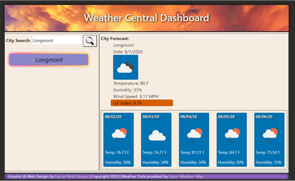

# 6-Weather-Dashboard-App

Weather App to display the current weather in given city.

Created Weather Dashboard so I can view the weather in any given city (provided that city is in the dataset) with the click of a button. When I search for a city it creates a button that I can use to access that city's data again when I click that button again.

I utilized the API data from OpenWeather.org.

https://falconreid.github.io/6-Weather-Dashboard-App/
https://github.com/falconreid/6-Weather-Dashboard-App

